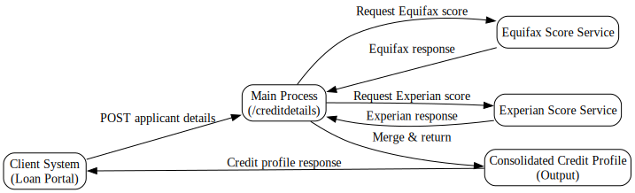
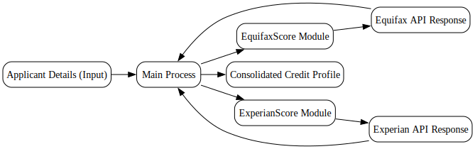

---
{}
---

# 📘 Credit Application Service Guide
<!-- CONFIDENCE_INLINE -->
> **Confidence Score:** 0.81 — *(see scoring table at bottom for details)*

This guide explains how the **Credit Application Service** works end-to-end. It is written for business stakeholders and avoids technical jargon where possible.  

---

## 🎯 Purpose
The Credit Application Service collects credit scores from multiple providers (Equifax and Experian) and consolidates them into a single response for downstream systems.  

---

## 🔑 Key Questions this answers
- What inputs does the service require?  
- What steps happen between request and response?  
- Which external providers are involved?  
- What outputs are returned to the business?  
- Where are the interdependencies?  

---

## 🛠️ End-to-End Flow

### 1. Input
- A client system (such as a loan application portal) sends a **POST request** to the **Main Process endpoint**:  
  - Endpoint: `/creditdetails`  
  - Method: `POST`  
  - Payload: Applicant details (exact schema: **Unknown**)  

### 2. Main Process Actions
- The **Main Process** (`creditapp.module.MainProcess`) receives the request.  
- It orchestrates calls to two sub-processes:  
  - **Equifax Score Service** (`creditapp.module.EquifaxScore`)  
  - **Experian Score Service** (`creditapp.module.ExperianScore`)  

### 3. Sub-Process Actions
- **Equifax Score Service**  
  - Endpoint: `/y54cuadtcxtfstqs3rux2gfdaxppoqgc/T1535409245354Converted/JsonSchema`  
  - Method: `POST` (exact details: **Unknown**)  
  - Returns: Structured Equifax credit score response  

- **Experian Score Service**  
  - Endpoint: `/y54cuadtcxtfstqs3rux2gfdaxppoqgc/T1535409245354Converted/JsonSchema`  
  - Methods: `POST` and `GET` supported (exact usage: **Unknown**)  
  - Returns: Structured Experian credit score response  

### 4. Consolidation
- The **Main Process** collects both responses.  
- It merges them into a single structured output.  
- Error handling and logging are built in to ensure traceability.  

### 5. Output
- A **consolidated credit profile** is returned to the requesting system.  
- Output includes:  
  - Equifax score  
  - Experian score  
  - Any error or status information  

---

## 🔗 Interdependencies & Data Touchpoints
| Component | Depends On | Purpose |
|-----------|------------|---------|
| Main Process (`creditapp.module.MainProcess`) | EquifaxScore, ExperianScore | Orchestrates calls and consolidates results |
| EquifaxScore (`creditapp.module.EquifaxScore`) | External Equifax service (details Unknown) | Retrieves Equifax credit score |
| ExperianScore (`creditapp.module.ExperianScore`) | External Experian service (details Unknown) | Retrieves Experian credit score |

- **Data Touchpoints:**  
  - Applicant details (input)  
  - Equifax API response  
  - Experian API response  
  - Consolidated credit profile (output)  

---

## 📊 Business Value
- Provides a **single point of access** for multiple credit bureaus.  
- Reduces manual effort by automating score retrieval.  
- Ensures **consistent and traceable** credit decision data.  

---

## 📎 Related Documents
- [creditapp.module.EquifaxScore](creditapp.module.EquifaxScore.md)  
- [creditapp.module.ExperianScore](creditapp.module.ExperianScore.md)  
- [creditapp.module.MainProcess](creditapp.module.MainProcess.md)  
- [Family_creditapp.module](Family_creditapp.module.md)  

---

✅ **Summary:** The Credit Application Service simplifies credit checks by combining Equifax and Experian scores into one response. The **Main Process** is the entry point, and it depends on the **EquifaxScore** and **ExperianScore** modules.  

## Visual Flow Diagrams

**credit-application-flow**

**dependencies-touchpoints**

<!-- CONFIDENCE_ROLLUP_START -->
## Confidence & Evidence Rollup

!!! info "How to read these scores"
    - **parsed** — base signal that the process was parsed at all (typically 0.5 when activities were found).
    - **known_types_coverage** — fraction of activities recognized as known BW types (higher is better; low values mean many unknown/opaque steps).
    - **transition_integrity** — 1.0 if all transitions link valid activities; lower means broken/missing links.
    - **role_coverage** — evidence of key roles detected (interface.receive / invoke.process / data.jdbc / messaging.jms, etc.).
    - **evidence_strength** — proportion of claims backed by concrete evidence (e.g., detected endpoints, JDBC targets).
    - **inferred_fraction** — portion of the explanation based on hypotheses (higher = more guesswork).

    Examples:
    - High **known_types_coverage** (≥ 0.7): process uses well-identified palette activities (HTTP/REST/JDBC/JMS/etc.).
    - Low **transition_integrity** (< 1.0): transitions reference non-existent steps (XML issues or partial parse).
    - Low **evidence_strength** (≈ 0.0): few/no concrete endpoints, datastore names, or invocation targets detected.
    - Higher **inferred_fraction** (≥ 0.5): explanation relies on educated guesses (scant evidence in source).
    - Overall score is the average of component scores, penalized by any low scores.
| Document | Score | parsed | known_types | transition_integrity | role_coverage | evidence_strength | inferred_fraction |
|---|---:|---:|---:|---:|---:|---:|---:|
| creditapp.module.EquifaxScore.md | 0.81 | 0.50 | 0.00 | 1.00 | 0.13 | 1.00 | 0.00 |
| creditapp.module.ExperianScore.md | 0.81 | 0.50 | 0.00 | 1.00 | 0.07 | 1.00 | 0.00 |
| creditapp.module.MainProcess.md | 0.81 | 0.50 | 0.00 | 1.00 | 0.10 | 1.00 | 0.00 |
| Family_creditapp.module.md |  |  |  |  |  |  |  |

**Overall score (this document set):** 0.81

<!-- CONFIDENCE_ROLLUP_END -->
