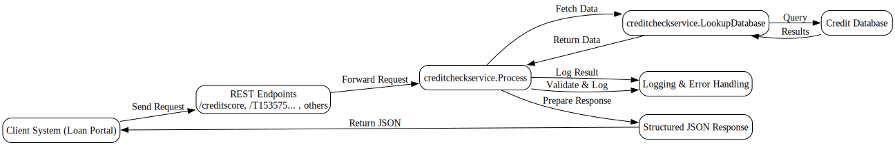

---
{}
---

# 📘 Credit Check Backend Service Guide
<!-- CONFIDENCE_INLINE -->
> **Confidence Score:** 0.81 — *(see scoring table at bottom for details)*

**Audience:** Business stakeholders (non-technical)  
**Purpose:** Explain how the Credit Check Backend Service works end-to-end, what inputs and outputs it handles, and how it connects with other systems.

---

## 🌐 Overview
The **Credit Check Backend Service** is a set of processes that receive requests from applications, look up credit-related data, and return structured results. It is the central service that supports credit decisioning by orchestrating database lookups and providing responses to client systems.

The service is made up of two main processes:
- **creditcheckservice.Process** — the main entry point for credit check requests.  
- **creditcheckservice.LookupDatabase** — a supporting process that queries the database and returns results.

---

## 🔄 End-to-End Flow

### 1. Input
- A client system (such as a loan application portal) sends a **REST request** to the service.  
- The request may include customer identifiers or application details.  
- Known endpoints:  
  - `/creditscore` (method: POST)  
  - `/T1535753828744Converted/JsonSchema` (method: Unknown)  
  - Other endpoints are **Unknown**.

### 2. Actions
- **creditcheckservice.Process** receives the request.  
  - It validates the input.  
  - It logs the request for traceability.  
  - It calls **creditcheckservice.LookupDatabase** to fetch data.  
- **creditcheckservice.LookupDatabase** performs the database query.  
  - It retrieves rows and columns from the credit database.  
  - It handles errors such as missing connections, invalid SQL, or duplicate keys.  
  - It returns the structured result back to the main process.  
- **creditcheckservice.Process** then:  
  - Logs success or failure.  
  - Prepares the final response.  
  - Sends the response back to the client system.

### 3. Output
- A structured JSON response containing credit-related data.  
- If errors occur, the service returns an error message with details for troubleshooting.

---

## 🔗 Interdependencies and Data Touchpoints
- **creditcheckservice.Process** depends on **creditcheckservice.LookupDatabase** to fetch actual credit data.  
- **creditcheckservice.LookupDatabase** interacts directly with the **credit database** via JDBC connections.  
- Both processes include **logging** and **error handling** to ensure traceability.  
- The service family is grouped under **Family_creditcheckservice**, which defines the shared endpoints and members.

---

## ❓ Key Questions this answers
- How does a credit check request get processed?  
- What systems and processes are involved?  
- Where does the service fetch data from?  
- What happens if there is an error?  
- What are the known endpoints for integration?  

---

## ⚠️ Known Unknowns
- Exact REST methods for some endpoints are **Unknown**.  
- The precise database schema and fields returned are **Unknown**.  
- The downstream systems consuming the responses are **Unknown**.  

---

## 📑 Related Documents
- [creditcheckservice.LookupDatabase](creditcheckservice.LookupDatabase.md)  
- [creditcheckservice.Process](creditcheckservice.Process.md)  
- [Family_creditcheckservice](Family_creditcheckservice.md)  

---

## ✅ Business Value
- Provides a **single backend service** for credit checks.  
- Ensures **consistent and traceable** responses.  
- Reduces manual effort by automating database lookups.  
- Supports **faster credit decisioning** for customer applications.  

---

## Visual Flow Diagrams

**credit-check-flow**

<!-- CONFIDENCE_ROLLUP_START -->
## Confidence & Evidence Rollup

!!! info "How to read these scores"
    - **parsed** — base signal that the process was parsed at all (typically 0.5 when activities were found).
    - **known_types_coverage** — fraction of activities recognized as known BW types (higher is better; low values mean many unknown/opaque steps).
    - **transition_integrity** — 1.0 if all transitions link valid activities; lower means broken/missing links.
    - **role_coverage** — evidence of key roles detected (interface.receive / invoke.process / data.jdbc / messaging.jms, etc.).
    - **evidence_strength** — proportion of claims backed by concrete evidence (e.g., detected endpoints, JDBC targets).
    - **inferred_fraction** — portion of the explanation based on hypotheses (higher = more guesswork).

    Examples:
    - High **known_types_coverage** (≥ 0.7): process uses well-identified palette activities (HTTP/REST/JDBC/JMS/etc.).
    - Low **transition_integrity** (< 1.0): transitions reference non-existent steps (XML issues or partial parse).
    - Low **evidence_strength** (≈ 0.0): few/no concrete endpoints, datastore names, or invocation targets detected.
    - Higher **inferred_fraction** (≥ 0.5): explanation relies on educated guesses (scant evidence in source).
    - Overall score is the average of component scores, penalized by any low scores.
| Document | Score | parsed | known_types | transition_integrity | role_coverage | evidence_strength | inferred_fraction |
|---|---:|---:|---:|---:|---:|---:|---:|
| creditcheckservice.LookupDatabase.md | 0.80 | 0.50 | 0.00 | 1.00 | 0.03 | 1.00 | 0.00 |
| creditcheckservice.Process.md | 0.81 | 0.50 | 0.00 | 1.00 | 0.07 | 1.00 | 0.00 |
| Family_creditcheckservice.md |  |  |  |  |  |  |  |

**Overall score (this document set):** 0.81

<!-- CONFIDENCE_ROLLUP_END -->
