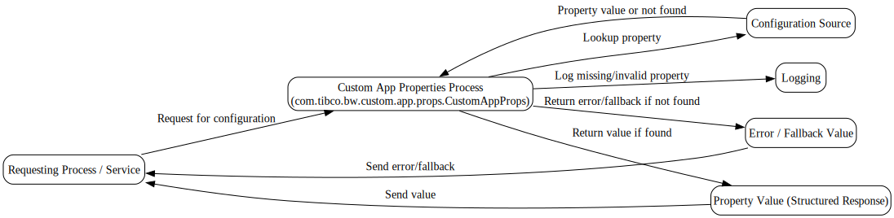

---
{}
---

# 📘 Custom App Properties Reference
<!-- CONFIDENCE_INLINE -->
> **Confidence Score:** 0.70 — *(see scoring table at bottom for details)*

## 🎯 Audience
This document is for business stakeholders who need to understand how **Custom App Properties** work in our system. It avoids technical jargon and focuses on what the process does, what it needs, and what it produces.

---

## 🔑 Key Questions this answers
- What are Custom App Properties and why do we use them?  
- What inputs do they require?  
- What outputs do they provide?  
- How do they connect with other processes or services?  
- Where are the interdependencies and data touchpoints?  

---

## 📝 Overview
The **Custom App Properties** process (`com.tibco.bw.custom.app.props.CustomAppProps`) provides a way to manage configuration values that the application needs at runtime.  

Think of it as a **central reference point** for application settings. Instead of hardcoding values, the system retrieves them dynamically. This makes the application more flexible and easier to maintain.

---

## 🔄 End-to-End Flow

| Step | Input | Action | Output |
|------|-------|--------|--------|
| 1️⃣ | Request for configuration (from another process or service) | The process looks up the requested property in its configuration source. | The requested property value (structured response). |
| 2️⃣ | If property not found | Logs the error and may return a default or error response. | Error message or fallback value. |

---

## 📌 Interdependencies & Data Touchpoints
- **Inputs:** Requests come from other business processes that need configuration values (for example, credit check modules or logging services).  
- **Outputs:** Provides structured property values back to the requesting process.  
- **Touchpoints:**  
  - Acts as a dependency for downstream processes that cannot run without correct configuration values.  
  - Logging and error handling ensure traceability if a property is missing or invalid.  
- **Known Dependencies:**  
  - Referenced in the **Family_com.tibco.bw.custom.app.props** domain grouping.  
  - Likely used by credit check and logging modules (exact usage: **Unknown**).  

---

## 📊 Business Value
- ✅ **Flexibility:** Business teams can adjust application behavior without code changes.  
- ✅ **Reliability:** Ensures consistent values across multiple processes.  
- ✅ **Traceability:** Clear logging makes it easier to troubleshoot configuration issues.  

---

## ⚠️ Unknowns
- Exact list of properties managed.  
- Which downstream modules consume which properties.  
- Whether defaults exist for missing properties.  

---

## 📂 Related Documents
- [com.tibco.bw.custom.app.props.CustomAppProps.md](com.tibco.bw.custom.app.props.CustomAppProps.md)  
- [Family_com.tibco.bw.custom.app.props.md](Family_com.tibco.bw.custom.app.props.md)  

---

✅ **In summary:** Custom App Properties act as the **single source of truth** for configuration values. They reduce risk, simplify maintenance, and ensure consistent behavior across the system.

## Visual Flow Diagrams

**custom-app-props-flow**

<!-- CONFIDENCE_ROLLUP_START -->
## Confidence & Evidence Rollup

!!! info "How to read these scores"
    - **parsed** — base signal that the process was parsed at all (typically 0.5 when activities were found).
    - **known_types_coverage** — fraction of activities recognized as known BW types (higher is better; low values mean many unknown/opaque steps).
    - **transition_integrity** — 1.0 if all transitions link valid activities; lower means broken/missing links.
    - **role_coverage** — evidence of key roles detected (interface.receive / invoke.process / data.jdbc / messaging.jms, etc.).
    - **evidence_strength** — proportion of claims backed by concrete evidence (e.g., detected endpoints, JDBC targets).
    - **inferred_fraction** — portion of the explanation based on hypotheses (higher = more guesswork).

    Examples:
    - High **known_types_coverage** (≥ 0.7): process uses well-identified palette activities (HTTP/REST/JDBC/JMS/etc.).
    - Low **transition_integrity** (< 1.0): transitions reference non-existent steps (XML issues or partial parse).
    - Low **evidence_strength** (≈ 0.0): few/no concrete endpoints, datastore names, or invocation targets detected.
    - Higher **inferred_fraction** (≥ 0.5): explanation relies on educated guesses (scant evidence in source).
    - Overall score is the average of component scores, penalized by any low scores.
| Document | Score | parsed | known_types | transition_integrity | role_coverage | evidence_strength | inferred_fraction |
|---|---:|---:|---:|---:|---:|---:|---:|
| com.tibco.bw.custom.app.props.CustomAppProps.md | 0.70 | 0.50 | 0.00 | 1.00 | 0.00 | 0.00 | 0.00 |
| Family_com.tibco.bw.custom.app.props.md |  |  |  |  |  |  |  |

**Overall score (this document set):** 0.70

<!-- CONFIDENCE_ROLLUP_END -->
