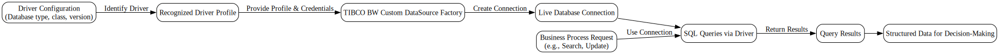
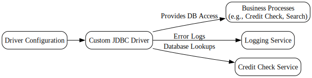

---
{}
---

# 📘 Custom JDBC Driver Reference
<!-- CONFIDENCE_INLINE -->
> **Confidence Score:** 0.70 — *(see scoring table at bottom for details)*

**Audience:** Business stakeholders who need to understand how our systems use a custom JDBC driver.  
**Tone:** Plain language, no technical jargon unless necessary.  

---

## 🌐 Overview
The **Custom JDBC Driver** is a connector that lets our applications talk to databases that are not supported out of the box. It acts as a bridge:  
- **Input:** Connection details (database type, version, and driver name).  
- **Action:** The driver translates these details into a usable connection.  
- **Output:** A working database connection that other business processes can use to search, get, or update data.  

This driver is packaged as the **TIBCO BW Custom DataSource Factory**. It defines the rules for how the system recognizes and uses the database driver.  

---

## 🔄 End-to-End Flow

| Step | Input | Action | Output |
|------|-------|--------|--------|
| 1️⃣ Identify Driver | Database type, driver class, driver version | The system reads these details from configuration | A recognized driver profile |
| 2️⃣ Create Connection | Driver profile, database credentials | The factory builds a connection object | A live connection to the database |
| 3️⃣ Use Connection | Business process requests (e.g., "Search customer record") | The system sends SQL queries through the driver | Query results returned to the process |
| 4️⃣ Return Results | Query results | The system formats and passes results back to the requesting process | Structured data available for decision-making |

---

## 🔗 Interdependencies & Data Touchpoints
- **Driver Configuration → Business Processes**  
  If the driver is not correctly configured, downstream processes (like credit checks or movie searches) cannot access their databases.  
- **Logging Service** (via related family docs) may capture errors if the driver fails.  
- **Credit Check Services** depend on database lookups that may use this driver.  

---

## ❓ Key Questions this answers
- How does the system connect to unsupported databases?  
- What information is needed to set up a custom driver?  
- What happens if the driver fails?  
- Which processes depend on this driver?  

---

## ⚠️ Limitations / Unknowns
- Which exact databases are supported: **Unknown**  
- Which business processes currently use this driver: **Unknown**  

---

## 📑 Related Documents
These documents provide more detail on connected processes and families:

- [TIBCO BW Custom DataSource Factory.md](TIBCO%20BW%20Custom%20DataSource%20Factory.md)  
- [Family_custom.jdbc.driver.md](Family_custom.jdbc.driver.md)  
- [Family_loggingservice.md](Family_loggingservice.md)  
- [Family_creditcheckservice.md](Family_creditcheckservice.md)  

---

✅ **In summary:** The Custom JDBC Driver is the foundation that allows our applications to connect to specialized databases. It ensures that business processes like credit checks or catalog searches can reliably access the data they need. Without it, those processes would fail at the very first step: connecting to the database.

## Visual Flow Diagrams

**end_to_end_flow**

**dependencies**

<!-- CONFIDENCE_ROLLUP_START -->
## Confidence & Evidence Rollup

!!! info "How to read these scores"
    - **parsed** — base signal that the process was parsed at all (typically 0.5 when activities were found).
    - **known_types_coverage** — fraction of activities recognized as known BW types (higher is better; low values mean many unknown/opaque steps).
    - **transition_integrity** — 1.0 if all transitions link valid activities; lower means broken/missing links.
    - **role_coverage** — evidence of key roles detected (interface.receive / invoke.process / data.jdbc / messaging.jms, etc.).
    - **evidence_strength** — proportion of claims backed by concrete evidence (e.g., detected endpoints, JDBC targets).
    - **inferred_fraction** — portion of the explanation based on hypotheses (higher = more guesswork).

    Examples:
    - High **known_types_coverage** (≥ 0.7): process uses well-identified palette activities (HTTP/REST/JDBC/JMS/etc.).
    - Low **transition_integrity** (< 1.0): transitions reference non-existent steps (XML issues or partial parse).
    - Low **evidence_strength** (≈ 0.0): few/no concrete endpoints, datastore names, or invocation targets detected.
    - Higher **inferred_fraction** (≥ 0.5): explanation relies on educated guesses (scant evidence in source).
    - Overall score is the average of component scores, penalized by any low scores.
| Document | Score | parsed | known_types | transition_integrity | role_coverage | evidence_strength | inferred_fraction |
|---|---:|---:|---:|---:|---:|---:|---:|
| TIBCO BW Custom DataSource Factory.md | 0.70 | 0.50 | 0.00 | 1.00 | 0.00 | 0.00 | 0.00 |
| Family_custom.jdbc.driver.md |  |  |  |  |  |  |  |

**Overall score (this document set):** 0.70

<!-- CONFIDENCE_ROLLUP_END -->
