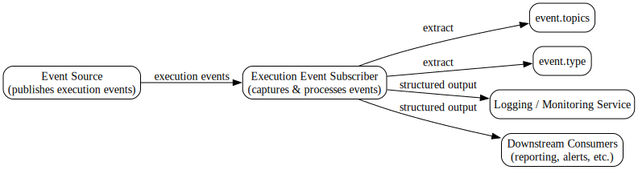

---
{}
---

# 📘 Execution Event Subscriber Guide
<!-- CONFIDENCE_INLINE -->
> **Confidence Score:** 0.70 — *(see scoring table at bottom for details)*

## 🎯 Purpose
This guide explains the **Execution Event Subscriber** process in plain language for business stakeholders. It describes what inputs it receives, what actions it performs, and what outputs it produces. It also highlights where this process connects with other systems.

---

## ❓ Key Questions this answers
- What does the Execution Event Subscriber do?
- What information does it receive and produce?
- How does it interact with other processes or services?
- Where are the interdependencies and data touchpoints?

---

## 🔄 End-to-End Flow

### Inputs → Actions → Outputs

| Step | Description | Example |
|------|-------------|---------|
| **Input** | The subscriber listens for **execution events**. These events contain two key pieces of information:  • `event.topics` (the subject area of the event)  • `event.type` (the kind of event, e.g., "Start", "Complete"). | A process execution event is published with topic = "CreditCheck" and type = "Complete". |
| **Action** | The subscriber process captures the event and applies simple domain logic. It may log the event, validate it, or prepare it for downstream use. | The subscriber records that a "CreditCheck" process has completed. |
| **Output** | A structured response is generated. This response can be consumed by downstream systems for monitoring, reporting, or triggering follow-up actions. | A structured event record is sent to the logging service or monitoring dashboard. |

---

## 🔗 Interdependencies and Data Touchpoints
- **Event Source**: The subscriber depends on upstream processes that publish execution events. Without published events, the subscriber has no input.
- **Logging**: The subscriber often forwards structured results to logging or monitoring services for traceability.
- **Downstream Consumers**: Other processes may rely on the subscriber’s structured output to trigger follow-up actions (e.g., reporting, alerts).
- **Data Touchpoints**:  
  - `event.topics` → identifies the business area affected.  
  - `event.type` → identifies the stage or status of the event.  

---

## 🧭 Business Value
- Provides **visibility** into process execution by capturing and structuring events.  
- Ensures **traceability** by logging event details.  
- Supports **decision-making** by making execution data available to downstream systems.  

---

## ⚠️ Unknowns
- Exact list of event types supported: **Unknown**  
- Specific downstream systems consuming the structured response: **Unknown**  
- Error handling and retry behavior: **Unknown**  

---

## 📂 Related Documents
Based on interdependencies and domain grouping, the following documents are relevant:

- [Family_tibco.bw.sample.application.execution.event.md](Family_tibco.bw.sample.application.execution.event.md)  
- [tibco.bw.sample.application.execution.event.subscriber.md](tibco.bw.sample.application.execution.event.subscriber.md)  

---

✅ **In summary**: The Execution Event Subscriber listens for execution events, captures key details (`event.topics`, `event.type`), and produces structured outputs that downstream systems can use for monitoring, reporting, or triggering actions. It is a key enabler for visibility and traceability across business processes.

## Visual Flow Diagrams

**execution-event-subscriber-flow**

<!-- CONFIDENCE_ROLLUP_START -->
## Confidence & Evidence Rollup

!!! info "How to read these scores"
    - **parsed** — base signal that the process was parsed at all (typically 0.5 when activities were found).
    - **known_types_coverage** — fraction of activities recognized as known BW types (higher is better; low values mean many unknown/opaque steps).
    - **transition_integrity** — 1.0 if all transitions link valid activities; lower means broken/missing links.
    - **role_coverage** — evidence of key roles detected (interface.receive / invoke.process / data.jdbc / messaging.jms, etc.).
    - **evidence_strength** — proportion of claims backed by concrete evidence (e.g., detected endpoints, JDBC targets).
    - **inferred_fraction** — portion of the explanation based on hypotheses (higher = more guesswork).

    Examples:
    - High **known_types_coverage** (≥ 0.7): process uses well-identified palette activities (HTTP/REST/JDBC/JMS/etc.).
    - Low **transition_integrity** (< 1.0): transitions reference non-existent steps (XML issues or partial parse).
    - Low **evidence_strength** (≈ 0.0): few/no concrete endpoints, datastore names, or invocation targets detected.
    - Higher **inferred_fraction** (≥ 0.5): explanation relies on educated guesses (scant evidence in source).
    - Overall score is the average of component scores, penalized by any low scores.
| Document | Score | parsed | known_types | transition_integrity | role_coverage | evidence_strength | inferred_fraction |
|---|---:|---:|---:|---:|---:|---:|---:|
| tibco.bw.sample.application.execution.event.subscriber.md | 0.70 | 0.50 | 0.00 | 1.00 | 0.00 | 0.00 | 0.00 |
| Family_tibco.bw.sample.application.execution.event.md |  |  |  |  |  |  |  |

**Overall score (this document set):** 0.70

<!-- CONFIDENCE_ROLLUP_END -->
