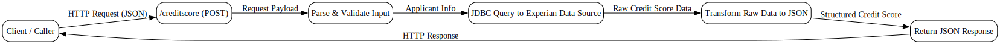
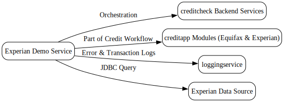

---
{}
---

# 📘 Experian Demo Service Guide
<!-- CONFIDENCE_INLINE -->
> **Confidence Score:** 0.80 — *(see scoring table at bottom for details)*

---

## 🎯 Purpose
This guide explains how the **Experian Demo Service** works end-to-end. It is written for business stakeholders who need to understand **what the service does**, **what data it touches**, and **how it connects with other systems**.  

---

## 🔑 Key Questions this answers
- What does the Experian Demo Service do?  
- What inputs does it take and what outputs does it return?  
- How does it interact with other systems?  
- Where are the main data touchpoints?  
- What dependencies should I be aware of?  

---

## 🛠️ Service Overview
The **Experian Demo Service** provides a REST-based interface to request and return **credit score data** from Experian.  

- **Process Name:** `experianservice.module.Process`  
- **Endpoint:** `/creditscore`  
- **Method:** `POST` (exact method is inferred; documentation lists as "Unknown")  
- **Primary Function:** Accepts a credit score request, queries data, and returns a structured JSON response.  

---

## 🔄 End-to-End Flow

| Step | Input | Action | Output |
|------|-------|--------|---------|
| 1️⃣ Receive Request | REST call to `/creditscore` (POST) | Service receives HTTP request | Request payload accepted |
| 2️⃣ Parse Input | JSON payload | Service parses and validates input | Structured request object |
| 3️⃣ Query Data | Request details (e.g., applicant info) | Service executes a **JDBC query** to Experian data source | Raw credit score data |
| 4️⃣ Transform Data | Raw data | Service transforms into JSON response format | Structured credit score response |
| 5️⃣ Send Response | Structured JSON | Service sends HTTP response back to caller | Credit score result delivered |

---

## 📊 Data Touchpoints & Dependencies
- **Input Data:** Applicant details (exact fields = Unknown)  
- **Database Query:** Uses JDBC to fetch Experian credit score data  
- **Output Data:** JSON response containing credit score information  
- **Error Handling:** Built-in error reporting for invalid input, database errors, and HTTP issues  

**Interdependencies:**  
- Relies on **creditcheck backend services** for orchestration.  
- Works alongside **creditapp modules** (Equifax and Experian score modules) in the broader credit-checking process.  
- Uses **loggingservice** for error and transaction tracking.  

---

## ⚠️ Business Considerations
- **Data Accuracy:** The service depends on Experian’s data source. Any outage or delay at Experian impacts results.  
- **Compliance:** Credit score data is sensitive; ensure proper handling and governance.  
- **Integration:** This service is one part of a larger **credit check workflow** that may also query Equifax.  

---

## 📂 Related Documents
For deeper understanding of dependencies and related flows, see:  

- [creditapp.module.ExperianScore.md](creditapp.module.ExperianScore.md)  
- [creditapp.module.EquifaxScore.md](creditapp.module.EquifaxScore.md)  
- [creditapp.module.MainProcess.md](creditapp.module.MainProcess.md)  
- [creditcheck-backend.md](creditcheck-backend.md)  
- [creditcheckservice.Process.md](creditcheckservice.Process.md)  
- [loggingservice.LogProcess.md](loggingservice.LogProcess.md)  
- [Family_experianservice.module.md](Family_experianservice.module.md)  

---

## ✅ Summary
The **Experian Demo Service** is a REST API that:  
- Accepts a credit score request  
- Queries Experian data via JDBC  
- Returns a structured JSON response  
- Integrates with the broader **credit check ecosystem**  

It is a **critical component** in delivering credit score results to downstream business processes.  

---  

## Visual Flow Diagrams

**experian-demo-service-flow**

**experian-service-dependencies**

<!-- CONFIDENCE_ROLLUP_START -->
## Confidence & Evidence Rollup

!!! info "How to read these scores"
    - **parsed** — base signal that the process was parsed at all (typically 0.5 when activities were found).
    - **known_types_coverage** — fraction of activities recognized as known BW types (higher is better; low values mean many unknown/opaque steps).
    - **transition_integrity** — 1.0 if all transitions link valid activities; lower means broken/missing links.
    - **role_coverage** — evidence of key roles detected (interface.receive / invoke.process / data.jdbc / messaging.jms, etc.).
    - **evidence_strength** — proportion of claims backed by concrete evidence (e.g., detected endpoints, JDBC targets).
    - **inferred_fraction** — portion of the explanation based on hypotheses (higher = more guesswork).

    Examples:
    - High **known_types_coverage** (≥ 0.7): process uses well-identified palette activities (HTTP/REST/JDBC/JMS/etc.).
    - Low **transition_integrity** (< 1.0): transitions reference non-existent steps (XML issues or partial parse).
    - Low **evidence_strength** (≈ 0.0): few/no concrete endpoints, datastore names, or invocation targets detected.
    - Higher **inferred_fraction** (≥ 0.5): explanation relies on educated guesses (scant evidence in source).
    - Overall score is the average of component scores, penalized by any low scores.
| Document | Score | parsed | known_types | transition_integrity | role_coverage | evidence_strength | inferred_fraction |
|---|---:|---:|---:|---:|---:|---:|---:|
| experianservice.module.Process.md | 0.80 | 0.50 | 0.00 | 1.00 | 0.03 | 1.00 | 0.00 |
| Family_experianservice.module.md |  |  |  |  |  |  |  |

**Overall score (this document set):** 0.80

<!-- CONFIDENCE_ROLLUP_END -->
