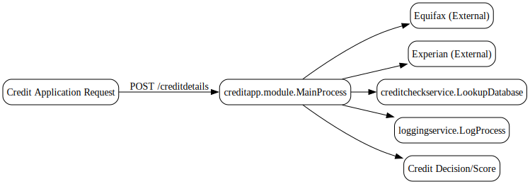
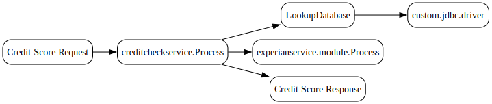
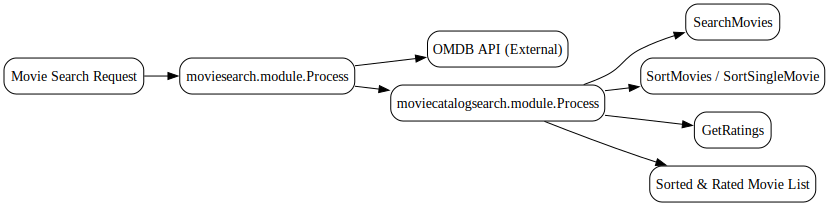
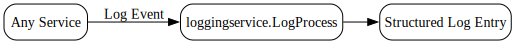

---
{}
---

# 📂 Repository Overview

*Generated at 2025-09-12T18:03:47.152480 (tool bw-orchestrator-1.3.0)*

---

## 🎯 Purpose
This document explains the structure and flows in the repository for **non-technical stakeholders**. It describes what each part does, how data moves through the system, and where services depend on each other.

---

## 🗂 Domain Families
The repository is organized into several families of processes:

| Family | Purpose (Plain Language) | # of Processes |
|--------|---------------------------|----------------|
| **com.tibco.bw.custom.app.props** | Custom application configuration | 1 |
| **creditapp.module** | Credit application scoring and orchestration | 3 |
| **creditcheckservice** | Credit check database lookups and scoring | 4 |
| **custom.jdbc.driver** | Custom database driver integration | 1 |
| **experianservice.module** | External Experian credit score service | 1 |
| **loggingservice** | Centralized logging | 1 |
| **moviecatalogsearch.module** | Movie catalog search, sort, and ratings | 14 |
| **moviesearch.module** | Movie search via OMDB API | 2 |
| **tibco.bw.sample.application.execution.event** | Event subscription sample | 1 |

---

## 🔄 End-to-End Flows

### 1. Credit Application Flow
**Inputs → Actions → Outputs**

- **Input:** A credit application request (customer details).  
- **Actions:**  
  - `creditapp.module.MainProcess` receives the request (`POST /creditdetails`).  
  - Calls **Equifax** (`creditapp.module.EquifaxScore`, `POST Unknown`) and **Experian** (`creditapp.module.ExperianScore`, `GET/POST Unknown`) modules.  
  - Uses `creditcheckservice.LookupDatabase` to fetch stored credit history.  
  - Aggregates results into a combined credit score.  
  - Logs activity via `loggingservice.LogProcess`.  
- **Output:** A credit decision or score returned to the requester.

**Dependencies:**  
- Relies on **external credit bureaus** (Equifax, Experian).  
- Relies on **internal database lookups**.  
- Relies on **logging service** for audit trail.

---

### 2. Credit Check Service Flow
**Inputs → Actions → Outputs**

- **Input:** Credit score request (`GET/POST /creditscore`).  
- **Actions:**  
  - `creditcheckservice.Process` orchestrates the request.  
  - Calls `LookupDatabase` for stored history.  
  - May call `experianservice.module.Process` (`POST /creditscore`) for external validation.  
- **Output:** Credit score response (schema-defined).  

**Dependencies:**  
- Database access via `custom.jdbc.driver`.  
- External Experian service.  

---

### 3. Movie Search & Catalog Flow
**Inputs → Actions → Outputs**

- **Input:** Movie search request (`GET /movies`).  
- **Actions:**  
  - `moviesearch.module.Process` handles search requests.  
  - Calls `moviesearch.module.SearchOmdb` to query OMDB API.  
  - `moviecatalogsearch.module.Process` enriches results (`GET /movies`).  
  - `moviecatalogsearch.module.SearchMovies` filters and structures results.  
  - `moviecatalogsearch.module.SortMovies` and `SortSingleMovie` order results.  
  - `moviecatalogsearch.module.GetRatings` attaches ratings.  
- **Output:** A sorted, rated list of movies.  

**Dependencies:**  
- External **OMDB API**.  
- Internal catalog enrichment services.  

---

### 4. Logging Flow
**Inputs → Actions → Outputs**

- **Input:** Log event from any service.  
- **Actions:**  
  - `loggingservice.LogProcess` captures and structures the log.  
  - Stores or forwards logs for monitoring.  
- **Output:** Structured log entry.  

**Dependencies:**  
- Used by **creditapp** and **creditcheckservice** for audit and compliance.  

---

## ❓ Key Questions this Answers
- How does a credit application get processed end-to-end?  
- Which services call external credit bureaus?  
- How do we enrich and sort movie search results?  
- Where are logs captured and stored?  
- Which processes depend on database lookups?  

---

## 📎 Related Documents
For deeper detail, see:

- [creditapp-service.md](creditapp-service.md)  
- [creditapp.module.MainProcess.md](creditapp.module.MainProcess.md)  
- [creditapp.module.EquifaxScore.md](creditapp.module.EquifaxScore.md)  
- [creditapp.module.ExperianScore.md](creditapp.module.ExperianScore.md)  
- [creditcheckservice.Process.md](creditcheckservice.Process.md)  
- [creditcheckservice.LookupDatabase.md](creditcheckservice.LookupDatabase.md)  
- [experian-service.md](experian-service.md)  
- [experianservice.module.Process.md](experianservice.module.Process.md)  
- [logging-service.md](logging-service.md)  
- [loggingservice.LogProcess.md](loggingservice.LogProcess.md)  
- [moviesearch-service.md](moviesearch-service.md)  
- [moviesearch.module.Process.md](moviesearch.module.Process.md)  
- [moviesearch.module.SearchOmdb.md](moviesearch.module.SearchOmdb.md)  
- [moviecatalog-service.md](moviecatalog-service.md)  
- [moviecatalogsearch.module.Process.md](moviecatalogsearch.module.Process.md)  
- [moviecatalogsearch.module.SearchMovies.md](moviecatalogsearch.module.SearchMovies.md)  
- [moviecatalogsearch.module.SortMovies.md](moviecatalogsearch.module.SortMovies.md)  
- [moviecatalogsearch.module.SortSingleMovie.md](moviecatalogsearch.module.SortSingleMovie.md)  
- [moviecatalogsearch.module.GetRatings.md](moviecatalogsearch.module.GetRatings.md)  

---

✅ This overview helps stakeholders understand **what the repository does, how services interact, and where external dependencies exist**. 

## Visual Flow Diagrams

**credit-application-flow**

**credit-check-service-flow**

**movie-search-catalog-flow**

**logging-flow**

<!-- CONFIDENCE_ROLLUP_START -->
## Confidence & Evidence Rollup

!!! info "How to read these scores"
    - **parsed** — base signal that the process was parsed at all (typically 0.5 when activities were found).
    - **known_types_coverage** — fraction of activities recognized as known BW types (higher is better; low values mean many unknown/opaque steps).
    - **transition_integrity** — 1.0 if all transitions link valid activities; lower means broken/missing links.
    - **role_coverage** — evidence of key roles detected (interface.receive / invoke.process / data.jdbc / messaging.jms, etc.).
    - **evidence_strength** — proportion of claims backed by concrete evidence (e.g., detected endpoints, JDBC targets).
    - **inferred_fraction** — portion of the explanation based on hypotheses (higher = more guesswork).

    Examples:
    - High **known_types_coverage** (≥ 0.7): process uses well-identified palette activities (HTTP/REST/JDBC/JMS/etc.).
    - Low **transition_integrity** (< 1.0): transitions reference non-existent steps (XML issues or partial parse).
    - Low **evidence_strength** (≈ 0.0): few/no concrete endpoints, datastore names, or invocation targets detected.
    - Higher **inferred_fraction** (≥ 0.5): explanation relies on educated guesses (scant evidence in source).
    - Overall score is the average of component scores, penalized by any low scores.
| Document | Score | parsed | known_types | transition_integrity | role_coverage | evidence_strength | inferred_fraction |
|---|---:|---:|---:|---:|---:|---:|---:|
| REPO_OVERVIEW.md |  |  |  |  |  |  |  |
<!-- CONFIDENCE_ROLLUP_END -->
