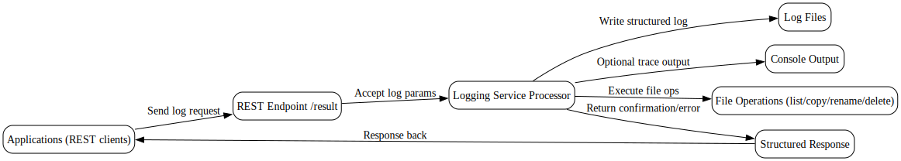
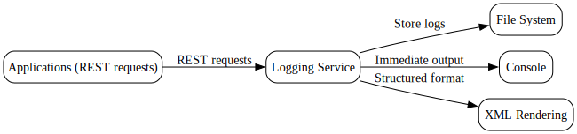

---
{}
---

# 📘 Logging Service Guide
<!-- CONFIDENCE_INLINE -->
> **Confidence Score:** 0.80 — *(see scoring table at bottom for details)*

## 🎯 Purpose
This guide explains the **Logging Service** in plain language for business stakeholders. It describes what the service does, how it works end-to-end, and how it connects with other systems.

---

## 🔑 Key Questions this answers
- What does the Logging Service do?
- What information goes in and comes out?
- How do other systems use it?
- What dependencies or touchpoints exist?
- What is still unknown?

---

## 📝 What the Logging Service Does
The **Logging Service** provides a way for applications to record and retrieve structured log information.  

- It receives requests through a REST endpoint (`{http://www.example.org/LogResult}result`).  
- It processes the request by capturing details such as:
  - Application name  
  - Job ID  
  - Process instance ID  
  - Error messages or stack traces (if any)  
  - Log level (e.g., Info, Warning, Error)  
- It writes this information into log files or structured outputs.  
- It can also read back log files, list available logs, and handle file operations like create, copy, rename, or remove.  

---

## 🔄 End-to-End Flow (Inputs → Actions → Outputs)

| Step | Input | Action | Output |
|------|-------|--------|--------|
| 1️⃣ Receive Request | REST call to `result` endpoint | Service accepts log parameters (message, level, job ID, etc.) | Request acknowledged |
| 2️⃣ Process Log Data | Log parameters | Service enriches with context (application, process ID, error details) | Structured log entry |
| 3️⃣ Write Log | Structured log entry | Service writes to file or console | Log file updated |
| 4️⃣ Optional File Ops | File commands (list, copy, rename, delete) | Service executes file operation | Updated file system |
| 5️⃣ Return Response | Processed log result | Service sends structured response back | Confirmation or error report |

---

## 🤝 Interdependencies & Data Touchpoints
- **Inputs**: REST requests from other applications (Unknown which specific apps).  
- **Outputs**: Log files and structured responses.  
- **Data Touchpoints**:
  - File system (for storing logs).  
  - Console output (for immediate traceability).  
  - XML rendering (for structured log formats).  
- **Dependencies**: Unknown external systems that consume or trigger logging.  

---

## 📊 Business Value
- Provides **traceability** for business processes.  
- Ensures **auditability** by capturing job IDs, application names, and error codes.  
- Improves **operational visibility** by centralizing logs.  
- Reduces risk by enabling **error tracking** and **root cause analysis**.  

---

## ⚠️ Unknowns
- Exact REST methods (GET/POST/PUT) are **Unknown**.  
- Which downstream systems consume the logs is **Unknown**.  
- Whether logs are persisted in a database or only in files is **Unknown**.  

---

## 📂 Related Documents
For deeper technical or process-level details, see:

- [loggingservice.LogProcess.md](loggingservice.LogProcess.md)  
- [Family_loggingservice.md](Family_loggingservice.md)  

---

✅ **Summary**: The Logging Service is a central utility that captures, stores, and manages log information across applications. It ensures traceability and error handling but requires clarification on exact REST methods and downstream consumers.

## Visual Flow Diagrams

**logging-service-flow**

**logging-service-touchpoints**

<!-- CONFIDENCE_ROLLUP_START -->
## Confidence & Evidence Rollup

!!! info "How to read these scores"
    - **parsed** — base signal that the process was parsed at all (typically 0.5 when activities were found).
    - **known_types_coverage** — fraction of activities recognized as known BW types (higher is better; low values mean many unknown/opaque steps).
    - **transition_integrity** — 1.0 if all transitions link valid activities; lower means broken/missing links.
    - **role_coverage** — evidence of key roles detected (interface.receive / invoke.process / data.jdbc / messaging.jms, etc.).
    - **evidence_strength** — proportion of claims backed by concrete evidence (e.g., detected endpoints, JDBC targets).
    - **inferred_fraction** — portion of the explanation based on hypotheses (higher = more guesswork).

    Examples:
    - High **known_types_coverage** (≥ 0.7): process uses well-identified palette activities (HTTP/REST/JDBC/JMS/etc.).
    - Low **transition_integrity** (< 1.0): transitions reference non-existent steps (XML issues or partial parse).
    - Low **evidence_strength** (≈ 0.0): few/no concrete endpoints, datastore names, or invocation targets detected.
    - Higher **inferred_fraction** (≥ 0.5): explanation relies on educated guesses (scant evidence in source).
    - Overall score is the average of component scores, penalized by any low scores.
| Document | Score | parsed | known_types | transition_integrity | role_coverage | evidence_strength | inferred_fraction |
|---|---:|---:|---:|---:|---:|---:|---:|
| loggingservice.LogProcess.md | 0.80 | 0.50 | 0.00 | 1.00 | 0.02 | 1.00 | 0.00 |
| Family_loggingservice.md |  |  |  |  |  |  |  |

**Overall score (this document set):** 0.80

<!-- CONFIDENCE_ROLLUP_END -->
