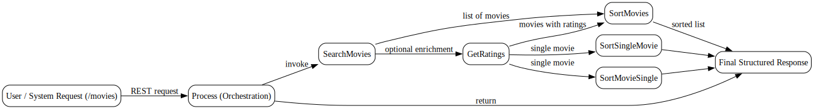
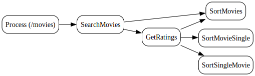

---
{}
---

# 🎬 Movie Catalog Search Service Guide
<!-- CONFIDENCE_INLINE -->
> **Confidence Score:** 0.80 — *(see scoring table at bottom for details)*

## 📌 Purpose
This guide explains how the **Movie Catalog Search Service** works from a business perspective. It describes the end-to-end flow of how movies are searched, retrieved, rated, and sorted. It is written for non-technical stakeholders and avoids technical jargon where possible.

---

## 👥 Audience
- Business owners  
- Product managers  
- Operations teams  
- Compliance and audit reviewers  

---

## 🔑 Key Questions this answers
- How do we **search for movies** in the catalog?  
- How do we **get ratings** for a movie?  
- How do we **sort movies** (lists or single items)?  
- What are the **inputs and outputs** at each step?  
- What other processes or services does this depend on?  

---

## 🛠️ Service Overview
The Movie Catalog Search Service is a **REST-based service family**. It supports searching, retrieving ratings, and sorting movies.  

The service is structured into **modules (processes)** that work together:

| Module | Purpose | Input | Output |
|--------|---------|-------|--------|
| **SearchMovies** | Finds movies based on search criteria. | Search request (title, keyword, etc.) | List of matching movies |
| **GetRatings** | Retrieves ratings for a given movie. | Movie ID or details | Ratings data (structured response) |
| **SortMovies** | Sorts a list of movies. | List of movies | Sorted list (by rating, title, etc.) |
| **SortMovieSingle** | Sorts a single movie record. | One movie entry | Sorted/enriched movie record |
| **SortSingleMovie** | Alternative single-movie sort process. | One movie entry | Sorted/enriched movie record |
| **Process** | Orchestrates the flow: Search → Sort → Return. | REST request (`/movies`) | Final structured movie list |

---

## 🔄 End-to-End Flow

### 1. **Search**
- **Input:** User or system sends a search request (e.g., movie title).  
- **Action:** `SearchMovies` process queries the catalog.  
- **Output:** A list of movies that match the search criteria.  

### 2. **Get Ratings**
- **Input:** Movie ID or details from the search results.  
- **Action:** `GetRatings` retrieves ratings (from internal or external sources).  
- **Output:** Ratings data attached to the movie record.  

### 3. **Sort**
- **Input:** List of movies (with or without ratings).  
- **Action:**  
  - `SortMovies` sorts multiple movies.  
  - `SortMovieSingle` or `SortSingleMovie` handle single entries.  
- **Output:** Ordered movie list or enriched single record.  

### 4. **Process (Orchestration)**
- **Input:** REST request to `/movies`.  
- **Action:** Calls `SearchMovies` → passes results to `SortMovies`.  
- **Output:** Final structured response with sorted movie list.  

---

## 🔗 Interdependencies & Data Touchpoints
- **SearchMovies** feeds results into **SortMovies**.  
- **GetRatings** can be called independently or as part of enrichment.  
- **SortMovies** depends on having structured movie data (from Search or external sources).  
- **Process** is the **entry point** (`/movies`) and coordinates the flow.  
- All modules share a **common error handling and logging framework** for traceability.  

---

## ⚠️ Known Unknowns
- Exact REST methods (GET/POST) for some endpoints are **Unknown**.  
- Some endpoint paths are placeholders (e.g., `/T1563811039923Converted/JsonSchema`).  
- Sorting criteria (alphabetical, rating, release date) are **not explicitly documented**.  

---

## 📂 Related Documents
For deeper technical details, see:  

- [moviecatalogsearch.module.GetRatings](moviecatalogsearch.module.GetRatings.md)  
- [moviecatalogsearch.module.Process](moviecatalogsearch.module.Process.md)  
- [moviecatalogsearch.module.SearchMovies](moviecatalogsearch.module.SearchMovies.md)  
- [moviecatalogsearch.module.SortMovieSingle](moviecatalogsearch.module.SortMovieSingle.md)  
- [moviecatalogsearch.module.SortMovies](moviecatalogsearch.module.SortMovies.md)  
- [moviecatalogsearch.module.SortSingleMovie](moviecatalogsearch.module.SortSingleMovie.md)  
- [Family_moviecatalogsearch.module](Family_moviecatalogsearch.module.md)  

---

## ✅ Business Value
- Provides a **single entry point** (`/movies`) for catalog search.  
- Ensures **consistent sorting and rating retrieval**.  
- Supports **traceability and audit** through logging.  
- Enables **flexibility**: modules can be reused independently (e.g., only ratings).  

---

📘 **In summary:**  
The Movie Catalog Search Service is a modular, REST-based system that lets us **search, enrich, and sort movies**. It is designed for reuse, traceability, and structured responses, making it a reliable foundation for movie-related business processes.  

## Visual Flow Diagrams

**end-to-end-flow**

**module-overview**

<!-- CONFIDENCE_ROLLUP_START -->
## Confidence & Evidence Rollup

!!! info "How to read these scores"
    - **parsed** — base signal that the process was parsed at all (typically 0.5 when activities were found).
    - **known_types_coverage** — fraction of activities recognized as known BW types (higher is better; low values mean many unknown/opaque steps).
    - **transition_integrity** — 1.0 if all transitions link valid activities; lower means broken/missing links.
    - **role_coverage** — evidence of key roles detected (interface.receive / invoke.process / data.jdbc / messaging.jms, etc.).
    - **evidence_strength** — proportion of claims backed by concrete evidence (e.g., detected endpoints, JDBC targets).
    - **inferred_fraction** — portion of the explanation based on hypotheses (higher = more guesswork).

    Examples:
    - High **known_types_coverage** (≥ 0.7): process uses well-identified palette activities (HTTP/REST/JDBC/JMS/etc.).
    - Low **transition_integrity** (< 1.0): transitions reference non-existent steps (XML issues or partial parse).
    - Low **evidence_strength** (≈ 0.0): few/no concrete endpoints, datastore names, or invocation targets detected.
    - Higher **inferred_fraction** (≥ 0.5): explanation relies on educated guesses (scant evidence in source).
    - Overall score is the average of component scores, penalized by any low scores.
| Document | Score | parsed | known_types | transition_integrity | role_coverage | evidence_strength | inferred_fraction |
|---|---:|---:|---:|---:|---:|---:|---:|
| moviecatalogsearch.module.GetRatings.md | 0.79 | 0.50 | 0.00 | 1.00 | 0.07 | 1.00 | 0.25 |
| moviecatalogsearch.module.Process.md | 0.80 | 0.50 | 0.00 | 1.00 | 0.07 | 1.00 | 0.25 |
| moviecatalogsearch.module.SearchMovies.md | 0.80 | 0.50 | 0.00 | 1.00 | 0.11 | 1.00 | 0.25 |
| moviecatalogsearch.module.SortMovies.md | 0.79 | 0.50 | 0.00 | 1.00 | 0.06 | 1.00 | 0.25 |
| moviecatalogsearch.module.SortMovieSingle.md | 0.80 | 0.50 | 0.00 | 1.00 | 0.10 | 1.00 | 0.25 |
| moviecatalogsearch.module.SortSingleMovie.md | 0.80 | 0.50 | 0.00 | 1.00 | 0.08 | 1.00 | 0.25 |
| Family_moviecatalogsearch.module.md |  |  |  |  |  |  |  |

**Overall score (this document set):** 0.80

<!-- CONFIDENCE_ROLLUP_END -->
