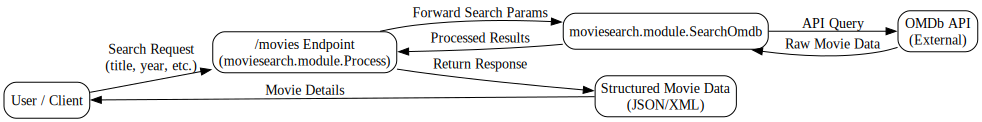

---
{}
---

# 🎬 Movie Search Service Guide
<!-- CONFIDENCE_INLINE -->
> **Confidence Score:** 0.81 — *(see scoring table at bottom for details)*

## 📌 Purpose
This guide explains how the **Movie Search Service** works from a business perspective. It is written for non-technical stakeholders and avoids technical jargon. It describes the service’s role, how it processes requests, and how it connects with other systems.

---

## 🔑 Key Questions this answers
- How does the Movie Search Service work end-to-end?  
- What inputs does it take, and what outputs does it provide?  
- What other services or processes does it depend on?  
- Where does the movie data come from?  
- What are the known and unknown details of the service?  

---

## 🏗️ Service Overview
The **Movie Search Service** allows users or systems to look up movie information. It is built from two main processes:

1. **moviesearch.module.Process**  
   - Acts as the entry point for search requests.  
   - Exposes a REST endpoint at **`/movies`** (method: Unknown).  
   - Handles incoming requests, manages flow, and returns structured results.  

2. **moviesearch.module.SearchOmdb**  
   - Connects to the external **OMDb API** (a public movie database).  
   - Executes the actual search against OMDb.  
   - Returns movie details back to the main process.  

---

## 🔄 End-to-End Flow

| Step | Action | Input | Output |
|------|--------|-------|--------|
| 1️⃣ | **Receive Search Request** | REST call to `/movies` (method: Unknown) | Request accepted |
| 2️⃣ | **Forward to OMDb Search** | Search parameters (e.g., title, year) | Query sent to OMDb |
| 3️⃣ | **OMDb API Lookup** | External API call | Raw movie data |
| 4️⃣ | **Process Results** | Raw OMDb response | Structured movie details |
| 5️⃣ | **Return Response** | Structured data | JSON/XML response to requester |

---

## 🔗 Interdependencies & Data Touchpoints
- **moviesearch.module.Process** depends on **moviesearch.module.SearchOmdb** to fetch movie data.  
- **moviesearch.module.SearchOmdb** depends on the **OMDb API** (external system).  
- Both processes include built-in error handling and logging for traceability.  
- Data flows:  
  - Input: Search criteria (title, year, etc.)  
  - Output: Movie details (title, year, ratings, etc.)  

---

## ⚠️ Known vs Unknown
- ✅ Known:  
  - Endpoint `/movies` exists.  
  - OMDb API is the external data source.  
  - Two processes: `Process` (entry point) and `SearchOmdb` (external lookup).  

- ❓ Unknown:  
  - Exact HTTP method for `/movies` (likely `GET`, but not confirmed).  
  - Full response schema (depends on OMDb API).  
  - Authentication requirements (if any).  

---

## 📂 Related Documents
These documents provide additional detail on related modules and processes:

- [moviesearch.module.Process](moviesearch.module.Process.md)  
- [moviesearch.module.SearchOmdb](moviesearch.module.SearchOmdb.md)  
- [Family_moviesearch.module](Family_moviesearch.module.md)  

---

## ✅ Summary
The **Movie Search Service** provides a structured way to search for movies. It accepts requests at `/movies`, forwards them to the OMDb API, processes the results, and returns structured movie data. It is a simple but critical integration point between internal systems and an external movie database.  

👉 This service is best understood as a **broker**: it takes in a request, delegates the search to OMDb, and delivers the results back in a consistent format.

## Visual Flow Diagrams

**movie-search-flow**

<!-- CONFIDENCE_ROLLUP_START -->
## Confidence & Evidence Rollup

!!! info "How to read these scores"
    - **parsed** — base signal that the process was parsed at all (typically 0.5 when activities were found).
    - **known_types_coverage** — fraction of activities recognized as known BW types (higher is better; low values mean many unknown/opaque steps).
    - **transition_integrity** — 1.0 if all transitions link valid activities; lower means broken/missing links.
    - **role_coverage** — evidence of key roles detected (interface.receive / invoke.process / data.jdbc / messaging.jms, etc.).
    - **evidence_strength** — proportion of claims backed by concrete evidence (e.g., detected endpoints, JDBC targets).
    - **inferred_fraction** — portion of the explanation based on hypotheses (higher = more guesswork).

    Examples:
    - High **known_types_coverage** (≥ 0.7): process uses well-identified palette activities (HTTP/REST/JDBC/JMS/etc.).
    - Low **transition_integrity** (< 1.0): transitions reference non-existent steps (XML issues or partial parse).
    - Low **evidence_strength** (≈ 0.0): few/no concrete endpoints, datastore names, or invocation targets detected.
    - Higher **inferred_fraction** (≥ 0.5): explanation relies on educated guesses (scant evidence in source).
    - Overall score is the average of component scores, penalized by any low scores.
| Document | Score | parsed | known_types | transition_integrity | role_coverage | evidence_strength | inferred_fraction |
|---|---:|---:|---:|---:|---:|---:|---:|
| moviesearch.module.Process.md | 0.81 | 0.50 | 0.00 | 1.00 | 0.08 | 1.00 | 0.00 |
| moviesearch.module.SearchOmdb.md | 0.81 | 0.50 | 0.00 | 1.00 | 0.10 | 1.00 | 0.00 |
| Family_moviesearch.module.md |  |  |  |  |  |  |  |

**Overall score (this document set):** 0.81

<!-- CONFIDENCE_ROLLUP_END -->
